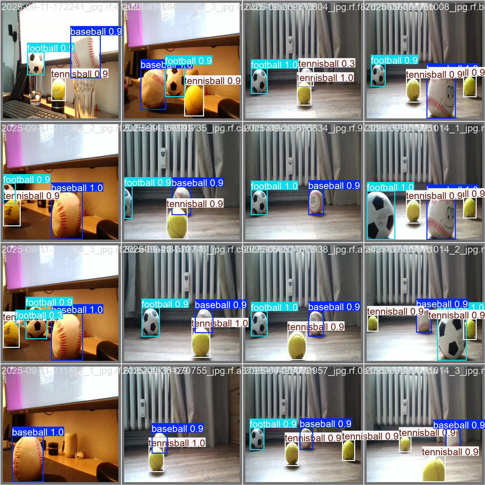

# YOLO_ROS2_FOLLOWING

This repository integrates YOLOv8 (You Only Look Once, version 8) with ROS 2 (Robot Operating System 2) for real-time object detection and autonomous following on a real robot.

<p align="center">
  <div style="display: inline-block; margin-right: 0px;">
    
  </div>
  <div style="display: inline-block; margin-left: 0px;">
    
  </div>
</p>

## Overview

The main goal is to reliably detect and classify specific objects (three ball classes), estimate their position within the camera frame, as well as their size and distance, and integrate these detections into the robot's control system, enabling interactive capabilities. The connection between ROS2 image topics and OpenCV (cv2) is handled using the ROS–OpenCV bridge cv_bridge.

<p align="center">
  
</p>

The Project is designed to:
- Fine-Tuning the YOLOv8n using transfer learning.
- Detect and classify three ball classes: football, tennis ball, baseball.
- Estimate position and distance within the camera frame.
- Convert detections into control commands, enabling robot interaction with the environment.

```bash
└── 📁yolo_ros2_following
    ├── 📁yolo_feintuning          # Package for dataset handling, training, and model fine-tuning      
    ├── 📁yolo_ros2_interaction    # ROS2 package for YOLO integration and following nodes
    ├── 📁figures                  # doc media
    ├── LICENSE
    ├── README.md                  # you are here
    ├── requirements.txt
    ├── Plakat.pdf
    └── yolo_3balls.pt             # fine-tuned YOLOv8n model
```

For better modularity and clarity, this repository is structured into two main packages as shown in the project directory above. Click on the package names for more details in their respective README files:

- [yolo_feintuning](./yolo_feintuning/README.md)
- [yolo_ros2_interaction](./yolo_ros2_interaction/README.md)

## License
This Work is licensed under the [Apache License 2.0](https://www.apache.org/licenses/LICENSE-2.0). See the [LICENSE](./LICENSE) file for details.