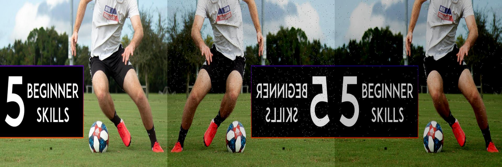
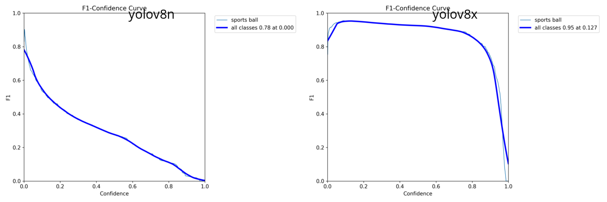

# YOLOv8 Fine-Tuning for Ball Detection

This package contains the scripts and resources used to fine-tune a **YOLOv8n** model for detecting three specific ball classes: `Baseball`, `Tennisball`, and `Football`. We used the **Ultralytics framework** to apply transfer learning, adapting a pre-trained model to our [custom dataset](https://app.roboflow.com/robotik-7goue/balldetector-pgfsi/5). The resulting model is the core of the computer vision system in the `yolo_ros2_interaction` package.
For easy navigation between sections, the following Table of Contents can be used:

- [YOLOv8 Fine-Tuning for Ball Detection](#yolov8-fine-tuning-for-ball-detection)
  - [Overview](#overview)
  - [Usage](#usage)
  - [Training Workflow](#training-workflow)
    - [1. Dataset Preparation](#1-dataset-preparation)
    - [2. Model Training](#2-model-training)
    - [3. Validation](#3-validation)
  - [Metrics](#metrics)
  - [Evaluation](#evaluation)

-----

## Overview

This package implements a workflow for fine-tuning YOLOv8 models. The workflow includes dataset preparation, model training, validation, and inference testing. The fine-tuned model enhances the robot's ability to detect and interact with different types of balls in real-world environments.

<details>
<summary>Click to expand Package Structure</summary>

```bash
└── 📁yolo_feintuning
    ├── 📁results
    │   ├── yolo_predict.py
    │   ├── yolo_train.py
    │   └── yolo_valid.py
    ├── 📁gifs
    │   ├── 📁predict               # Saved inference results
    │   ├── 📁train                 # Saved training results
    │   └── 📁val                   # Saved validation results
    └── 📁scripts
    │   ├── yolo_predict.py
    │   ├── yolo_train.py
    │   └── yolo_valid.py
    ├── README.md                   # you are here
    └── downlaodDataset3Calsses.py  # Dataset download script
```
</details>

-----

## Usage
The scripts are designed for a sequential workflow:

<details>
<summary>Click to expand</summary>

1.  **Download the dataset** using the provided script:
```python
python downlaodDataset3Calsses.py
```

1.  **Start training** by running the training script:
  ```python
  python yolo_train.py
  ```

1.  **Validate the models** to compare performance:
```python
python yolo_valid.py
```

1.  **Test predictions** on new images with the best model:
```python
python yolo_predict.py
```

All outputs from these scripts are saved in the `results` directory.


</details>

-----

## Training Workflow

Our workflow is structured into three main stages: dataset preparation, model training, and a final validation phase.

### 1\. Dataset Preparation

The model's performance relies on a specialized dataset created for this task, which is hosted on [Roboflow](https://app.roboflow.com/robotik-7goue/balldetector-pgfsi/5).

  * **Training Set**: Comprises 520 base images, with 176 captured directly from the robot's camera to match the deployment environment. This set was expanded to 1,560 images through augmentation:
      * Horizontal Flip
      * Brightness adjustment (±25%)
      * Blur (up to 0.5px)
      * Noise injection (up to 2%)

<p align="center">
  
</p>

* **Validation Set**: Consists of 120 images taken exclusively from the robot's perspective under various lighting conditions to ensure a realistic evaluation of the model's performance across different operational environments.

### 2\. Model Training

  The fine-tuning process was initiated using the [`yolo_train.py`](./scripts/yolo_train.py) script.

  * **Base Model**: We selected the `yolov8n.pt` model, pre-trained on the COCO dataset, as our starting point.
  * **Process**: Multiple training runs were conducted with varying epoch counts (10, 25, 50, 75, 100, 150, 200) to identify the checkpoint with the best performance before overfitting occurred.

### 3\. Validation

Systematic evaluation was performed using the [`yolo_valid.py`](yolo_feintuning\scripts\yolo_valid.py) script. This script was designed to benchmark our fine-tuned models against the original, pre-trained stock models. This comparison is essential to quantify the improvement achieved through fine-tuning.

-----

## Metrics
The following metrics are used to determine the performance of object detection models:

* **Confusion Matrix**
The confusion matrix visualizes prediction results by comparing predicted classes against actual classes. For our model, it shows how often a ball class was correctly identified or confused with another class.

* **Precision, Recall and F1-Score**
These metrics assess the accuracy of object detection:

- Precision: Measures what proportion of positive identifications were actually correct
\[
\text{Precision} = \frac{TP}{TP + FP}
\]

- Recall: Measures what proportion of actual positives were identified correctly
\[
\text{Recall} = \frac{TP}{TP + FN}
\]

- F1-Score: Harmonic mean of precision and recall, providing a balanced evaluation
\[
F_1-Score = 2 \cdot \frac{\text{Precision} \cdot \text{Recall}}{\text{Precision} + \text{Recall}}
\]

For more info see [What Is Precision and What Is Recall When Training Vision AI Models](https://oslo.vision/blog/what-is-precision-and-what-is-recall-when-training-computer-vision-ai-models/)

* **mAP (mean Average Precision)**
- Evaluates the accuracy of bounding boxes and class predictions
- mAP50: Average precision at IoU threshold of 0.5
- mAP50-95: Average of mAP values at IoU thresholds from 0.5 to 0.95 (in steps of 0.05)

For info about IoU see [Intersection over Union (IoU)](https://www.ultralytics.com/de/glossary/intersection-over-union-iou)

-----

## Evaluation

First, for a proper comparison, we evaluated both our starting point (the pretrained YOLOv8n) and the best pretrained model (YOLOv8x) on our custom validation dataset:

<p align="center">
    
</p>

The pre-trained YOLOv8n model achieves its maximum F1 score of 0.78 at a confidence threshold of 0.00, which renders it impractical for deployment with its current weights.

The pre-trained YOLOv8x model demonstrates better performance with a peak F1 score of 0.95, though this occurs at a low confidence threshold of 0.127.


The training with varying epoch counts (10, 25, 50, 75, 100, 150, 200) of the YOLOv8n can be witnessed in the following GIF files:

<p align="center">
    
</p>

The training loss analysis across 10 to 200 epochs reveals a clear convergence pattern. Short training periods (10-25 epochs) exhibit chaotic fluctuations and insufficient convergence, with training loss values around 0.45-0.50. The optimal range lies between 50-75 epochs, where all loss components converge stably to approximately 0.31-0.35 and training as well as validation losses follow parallel trajectories. Longer training periods (100-200 epochs) result in lower training loss values (0.28-0.30) but show clear overfitting signals through stagnating validation loss curves. Based on this results, the model trained with 75 epochs (complete convergence without overfitting and efficient resource utilization) will be deployed for the project.

The following two GIF files illustrate the F1-score and confusion matrices for all fine-tuned models.

<p align="center">
  <div style="display: inline-block; margin-right: 0px;">
    
  </div>
  <div style="display: inline-block; margin-left: 0px;">
    
  </div>
</p>

The model with 75 epochs achieves its maximum F1 score of 0.99 at a confidence threshold of 0.817, therefore this model will be deployed for the project with a confidence threshold of 0.8.