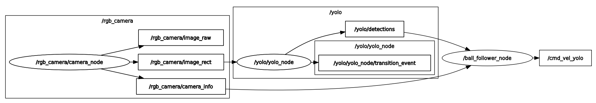
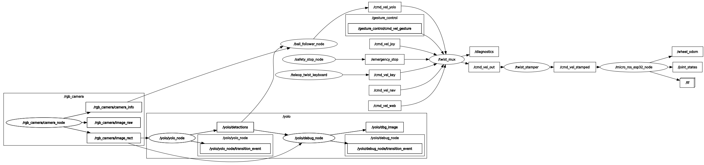

# yolo_ros2_interaction
This subfolder contains a ROS2 package that provides the required nodes and topics.  
First, its usage is described, followed by an explanation of the camera's intrinsic calibration and the following logic.  
For easy navigation between sections, the following Table of Contents can be used:

- [yolo\_ros2\_interaction](#yolo_ros2_interaction)
  - [Overview](#overview)
  - [Usage](#usage)
    - [1. Launch Commands:](#1-launch-commands)
    - [2. Available Launch Parameters](#2-available-launch-parameters)
      - [Camera Node Parameters](#camera-node-parameters)
      - [Ball Follower Node Parameters](#ball-follower-node-parameters)
  - [Camera Intrinsic Calibration using rgb\_camera/camera\_node](#camera-intrinsic-calibration-using-rgb_cameracamera_node)
  - [Following Logic using ball\_follower\_node](#following-logic-using-ball_follower_node)
    - [Distance Estimation](#distance-estimation)
    - [Control Implementation](#control-implementation)
      - [1. **Angular Control (Steering)**](#1-angular-control-steering)
      - [2. **Linear Control (Distance)**](#2-linear-control-distance)
  - [Components](#components)
    - [Topics \& Message-types](#topics--message-types)
    - [Nodes](#nodes)
      - [1. rgb\_camera/camera\_node](#1-rgb_cameracamera_node)
      - [2. ball\_follower\_node](#2-ball_follower_node)
  - [ROS2 Workflow](#ros2-workflow)


## Overview
This ROS2 package integrates computer vision-based object detection with the ROS2 framework.  
It uses the fine-tuned YOLOv8n model trained via transfer learning to detect and classify three different types of balls (football, tennis ball, and baseball), enabling a real robot to follow and interact with them.

<p align="center">
  
  <em>Camera-Objectfollower Pipeline</em>
</p>

**Key features:**
- ROS2 integration for seamless robot control
- Intrinsic camera calibration for accurate image undistortion and size estimation
- Implementation of the following logic for automatic ball tracking
- Maintains a configurable following distance (`stop_distance_m`) from the detected object


```bash
└── 📁yolo_ros2_following                   # Parent Package
    └── 📁yolo_ros2_interaction
        └── 📁config
            ├── usb_cam.yaml                # USB camera calibration file
            ├── web_cam.yaml                # Webcam calibration file
        └── 📁launch                        # Launch files for starting nodes
            ├── yolo_ros2_interaction_bringup.launch.py
            ├── ball_follower_node.launch.py
            ├── camera.launch.py
        └── 📁resource
            ├── yolo_ros2_interaction
        └── 📁yolo_ros2_interaction
            ├── __init__.py
            ├── ball_follower_node.py       # Ball following control
            ├── camera_node.py              # Image acquisition & camera info
        ├── package.xml
        ├── README.md                       # you are here
        ├── setup.cfg
        └── setup.py
```

## Usage
### 1. Launch Commands:
<details>
<summary>Click to expand launch options</summary>

- Launch the complete interaction system (camera & following):
```bash
# with default parameters
ros2 launch yolo_ros2_interaction yolo_ros2_interaction_bringup.launch.py
# with custom parameters (e.g football_diameter_m=0.3 & stop_distancd_m=0.25)
ros2 launch yolo_ros2_interaction yolo_ros2_interaction_bringup.launch.py football_diameter_m:= 0.3 stop_distancd_m:=0.25
```

- Launch only the camera Node
```bash
# With default parameters
ros2 launch yolo_ros2_interaction camera.launch.py
# With custom parameters
ros2 launch yolo_ros2_interaction camera.launch.py frame_rate:=60.0 camera_index:=1
```

- Launch only the ball follower node
```bash
# With default parameters
ros2 launch yolo_ros2_interaction ball_follower_node.launch.py
# With Custom parameters
ros2 launch yolo_ros2_interaction ball_follower_node.launch.py linear_speed_gain:=2.5 stop_distance_m:=0.25
```
</details>

### 2. Available Launch Parameters
ROS2 parameters provide **runtime configurability** without modifying the source code (see the launch commands above)
<details>
<summary>Click to expand parameter tables</summary>

#### Camera Node Parameters
| Parameter | Description | Default Value | Type |
|-----------|-------------|---------------|------|
| `camera_index` | Video device index | `0` | integer |
| `frame_rate` | Camera capture frequency | `30.0` | float |
| `camera_calibration_file` | Calibration YAML file | `'usb_cam.yaml'` | string |

#### Ball Follower Node Parameters
| Parameter | Description | Default Value | Type |
|-----------|-------------|---------------|------|
| `image_width` | Camera image width for calculations | `640` | integer |
| `linear_speed_gain` | Scaling factor for linear velocity | `3.0` | float |
| `stop_distance_m` | Target following distance | `0.30` | float |
| `tennisball_diameter_m` | Tennis ball physical diameter | `0.07` | float |
| `baseball_diameter_m` | Baseball physical diameter | `0.10` | float |
| `football_diameter_m` | Football physical diameter | `0.22` | float |

**Safety Limits:**
- **Linear velocity**: Limited to `±1.1 m/s` (applied after `linear_speed_gain` multiplication for safe operation)
- **Angular velocity**: Limited to `±1.7 rad/s` for safe operation

*These limits ensure safe robot operation regardless of linear_speed_gain parameter value.*
</details>

## Camera Intrinsic Calibration using [rgb_camera/camera_node](./yolo_ros2_interaction/camera_node.py)

The camera was calibrated using a chessboard pattern following the official ROS2 tutorial: [Monocular Calibration](https://docs.ros.org/en/rolling/p/camera_calibration/doc/tutorial_mono.html).

This intrinsic calibration serves **two main purposes**:

1. **Image Undistortion**  
    - The lens introduces distortion (bending of straight lines).  
    - Using the calibration parameters, an *undistorted*  image can be generated where geometry is preserved.  

2. **Physical Size Estimation**  
    - The camera matrix `K = [fx, 0, cx; 0, fy, cy; 0, 0, 1]` provides the focal lengths (`fx`, `fy`).  
    - With this, physical object sizes can be related to pixel sizes.  
    - These calibration parameters are stored in a [YAML](./config/usb_cam.yaml) file and later used by the following logic (explained below).

This enables the **real robot** not only to see an undistorted image, but also to **estimate distances and real-world object sizes** directly from the camera feed.

## Following Logic using [ball_follower_node](./yolo_ros2_interaction/ball_follower_node.py)

The ball following behavior combines distance estimation with proportional control. The system uses the calibrated camera parameters to convert 2D image information into 3D spatial relationships.

The `stop_distance_m` parameter defines the *target distance** between the robot and the detected ball.

The ball follower node adjusts the robot's linear velocity to maintain the target distance.

### Distance Estimation

The core principle relies on the **pinhole camera model** for distance estimation:

```
target_size_px = (focal_length * ball_diameter) / stop_distance_m
```

where `focal_length = (fx + fy) / 2` is the average focal length from the camera matrix.

For more information, visit [Image formation and pinhole camera model](https://csundergrad.science.uoit.ca/courses/cv-notes/notebooks/01-image-formation.html)

### Control Implementation

The following behavior uses a **dual-axis proportional controller**:
Small deviations around the target distance are naturally smoothed by the proportional controller and the defined velocity limits, avoiding abrupt movements.
#### 1. **Angular Control (Steering)**
```python
# Error calculation: deviation from image center
error_x = center_x - self.image_width / 2.0     # relative to half the image width
kp_angular = 1 / (self.image_width / 2.0)
angular_z = -float(error_x) * kp_angular
```

- **Purpose**: Centers the detected ball in the camera frame
- **Input**: Horizontal position of ball center (`center_x`)
- **Output**: Angular velocity command (`angular_z`)
- **Range**: `[-1.7, 1.7]` rad/s (with safety limits)

#### 2. **Linear Control (Distance)**
```python
# Target size calculation for desired distance
target_size_px = (focal_length * ball_diameter) / stop_distance_m

# Size error: difference between target and estimation
size_error = target_size_px - detected_width
kp_linear = 1 / target_size_px
linear_x = size_error * kp_linear
```

- **Purpose**: Maintains optimal following distance
- **Input**: Detected bounding box width (`detected_width`)
- **Output**: Linear velocity command (`linear_x`)
- **Range**: `[-1.1, 1.1]` m/s (with safety limits AFTER `linear_speed_gain` multiplication)


## Components

### Topics & Message-types
1. **rgb_camera/camera_node**
- `/rgb_camera/image_raw` [sensor_msgs/Image](https://docs.ros.org/en/noetic/api/sensor_msgs/html/msg/Image.html)
- `/rgb_camera/image_rect` [sensor_msgs/Image](https://docs.ros.org/en/noetic/api/sensor_msgs/html/msg/Image.html)
- `/rgb_camera/image_info` [sensor_msgs/CameraInfo](https://docs.ros2.org/latest/api/sensor_msgs/msg/CameraInfo.html)

2. **ball_follower_node**
- `/cmd_vel_yolo` [geometry_msgs/msg/Twist](https://docs.ros.org/en/noetic/api/geometry_msgs/html/msg/Twist.html)
- `/yolo/detections` [yolo_msgs/msg/DetectionArray](https://github.com/mgonzs13/yolo_ros/blob/main/yolo_msgs/msg/DetectionArray.msg)

### Nodes
#### 1. [rgb_camera/camera_node](./yolo_ros2_interaction/camera_node.py)
Captures and publishes camera images using the camera [HBVCAM-W202012HD V33](https://www.hbvcamera.com/1MP-%20HD-usb-cameras/hbvcam-ov9726-720p-hd-otg-free-driver-pc-webcam-camera-module.html?utm_source=chatgpt.com)

**Key Features**:
    - Handles camera calibration and image preprocessing
    - Publishes image data to `/rgb_camera/image_raw`, `/rgb_camera/image_rect`, `/rgb_camera/image_info`
    - **USB Camera Interface**: Uses OpenCV VideoCapture with V4L2 backend for Linux compatibility
    - **Dual Image Publishing**: Publishes both raw and rectified images
    - **Camera Calibration**: Loads [YAML calibration files](./config/usb_cam.yaml) for intrinsic camera parameters
    - **Latched Camera Info**: The camera calibration parameters (like focal length and lens distortion) are only needed once when the camera starts.  
      To avoid sending this information repeatedly, the node publishes it in a *latched* way (ROS2 `TRANSIENT_LOCAL` QoS).  
      This means any component that connects later still automatically receives the calibration info without requiring the camera to resend it.

#### 2. [ball_follower_node](./yolo_ros2_interaction/ball_follower_node.py)
Implements the ball-following behavior

**Key Features**:
    - Subscribes to camera info from `/rgb_camera/image_info` topic
    - Subscribes to yolo detections from `/yolo/detections` topic
    - Generates velocity commands based on detection results and publishes them to the `/cmd_vel_yolo` topic

## ROS2 Workflow
This project is summarized in the workflow shown in the *Camera-Objectfollower Pipeline* diagram above. 
It builds upon a customized version of the [yolo_ros](https://github.com/mgonzs13/yolo_ros) repository by Miguel Ángel González Santamarta. The original repository was cloned and adapted specifically for this project's requirements:


**Key Modifications:**
- **Streamlined Architecture**: Removed tracking components and nodes not relevant for this Project.
- **Reduced Message Overhead**: Eliminated unused message types and topics (e.g., instance segmentation, human pose, 3D object detection).
- **Custom Model Integration**: Integrated a fine-tuned YOLOv8n model trained specifically for three ball classes.
- **Lightweight Implementation**: Preserved only essential components for real-time detection and control.

**Model Configuration:**
The system uses the [fine-tuned YOLOv8n model](../yolo_3balls.pt), trained for 75 epochs using transfer learning on a [custom dataset](https://app.roboflow.com/robotik-7goue/balldetector-pgfsi/5).

**Integration with External Control Framework**
The control logic is based on a previously developed [project](https://github.com/majdros/desktop_ros2_ws/blob/main/README.md).
This existing workspace provides the robot's core motion architecture and is outside the scope of this project.

**Workflow Summary:**
The workflow of the current project can be summarized as follows:
1. Camera Node -> provides calibrated and rectified images.
2. YOLO Detection → runs via the customized [yolo_ros](https://github.com/mgonzs13/yolo_ros).
3. Ball Follower Node → converts detection outputs into velocity commands.
4. Previously developed project → consumes `/cmd_vel` and executes motion control on the robot.

The following figure illustrates the complete system, combining this project, the customized [yolo_ros](https://github.com/mgonzs13/yolo_ros), and the previously developed [project](https://github.com/majdros/desktop_ros2_ws/blob/main/README.md):  


<p align="center">
  
  <em>The complete workflow</em>
</p>